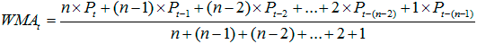
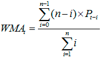
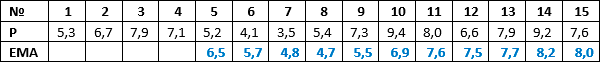
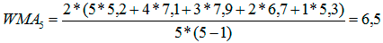
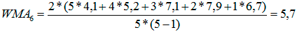
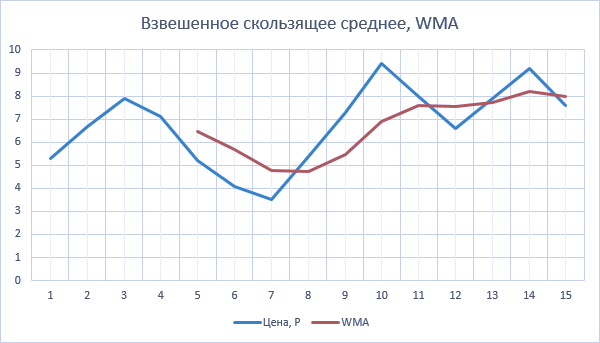

### Взвешенное скользящее среднее | Weighted Moving Average, WMA

В общем случае взвешенным скользящим средним (англ. Weighted Moving Average, WMA) 
является любое среднее, которое устанавливает различные весовые коэффициенты для 
наблюдаемых значений случайной величины. Идея его расчета заключается в том, 
чтобы придать больший вес новым наблюдениям, и меньший вес более старым наблюдениям. 
Это является логичным подходом в техническом анализе с точки зрения определения 
характера и силы превалирующего на рынке тренда. Такой подход позволяет не только 
сгладить резкие ценовые отклонения, но и более точно определить направление тренда, 
поскольку последним данным придается больший удельный вес.

##### Формула
В практике технического анализа наибольшее распространение получило линейно взвешенное 
скользящее среднее (англ. Linear Weighted Moving Average), формула расчета которого 
в общем виде выглядит следующим образом:

Представленная выше формула может быть записана в свернутом виде:

,где n – интервал сглаживания;
Pt-i – значение цены в период времени (t-i).

##### Пример расчета

Рассмотрим методику расчета линейно взвешенного скользящего среднего на примере данных о 
котировках акции, представленных в таблице.

Предположим, что интервал сглаживания равен 5. В этом случае первое значение WMA может 
быть рассчитано для 5-го периода. Подставив имеющиеся данные в приведенную выше формулу 
получим его значение равное 6,5.

Следующее значение WMA составит уже 5,7.

Дальнейшие расчеты проводятся аналогично, а их результаты представлены на графике.

Преимуществом этого показателя перед простым скользящим средним (англ. Simple 
Moving Average, SMA) является меньшее запаздывание. Это происходит в силу того, 
что наиболее старые данные имеют незначительный весовой коэффициент, а, следовательно, 
направление тренда устанавливается, главным образом, по последним данным. Например, 
если интервал сглаживания равен 15, то удельный вес трех последних значений цен 
будет равен 0,4, а первых трех 0,06.

(15+14+13)/105 = 0,4 *

(3+2+1)/105 = 0,06

* 105 представляет собой сумму чисел от 1 до 15

